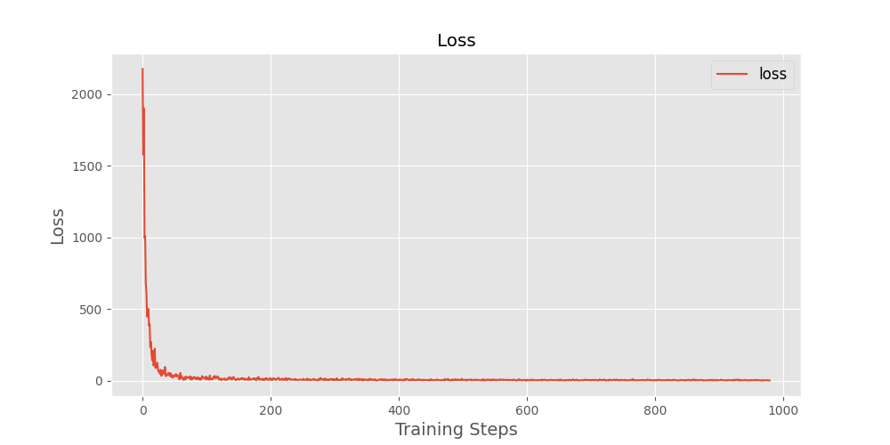
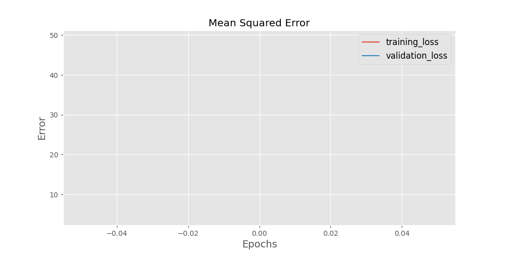
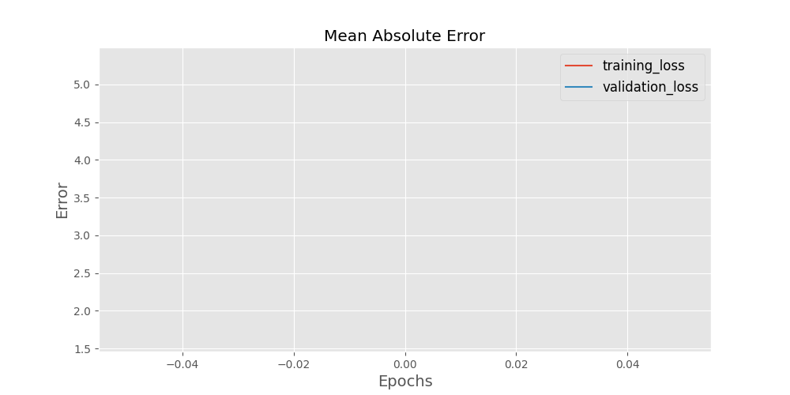
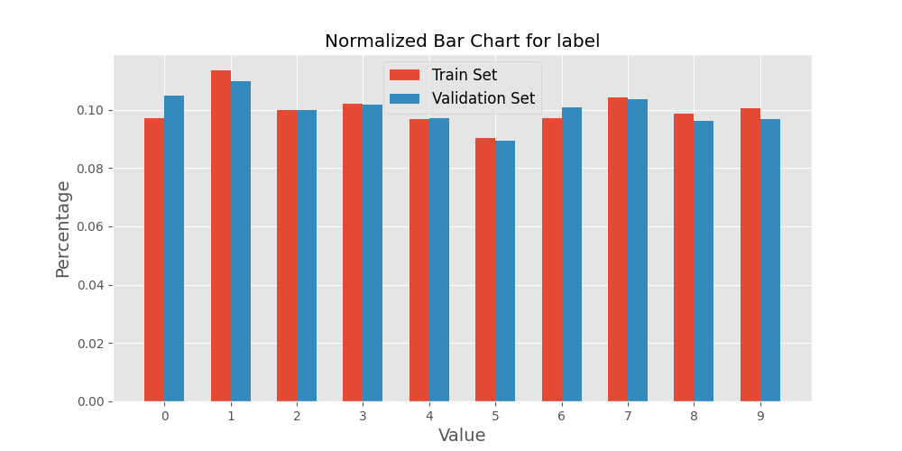
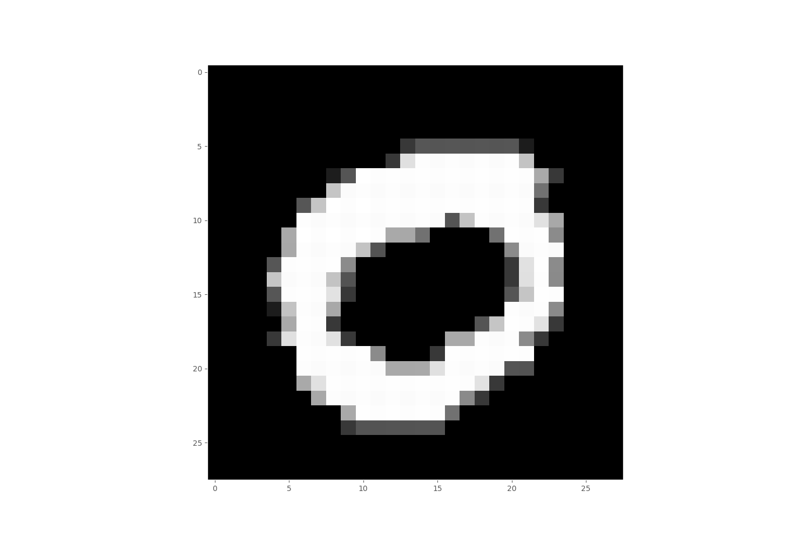
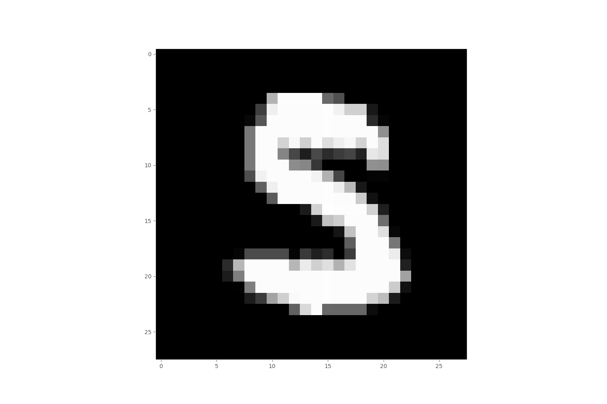
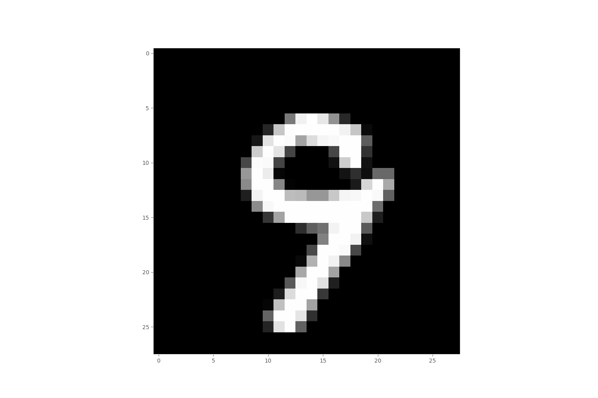
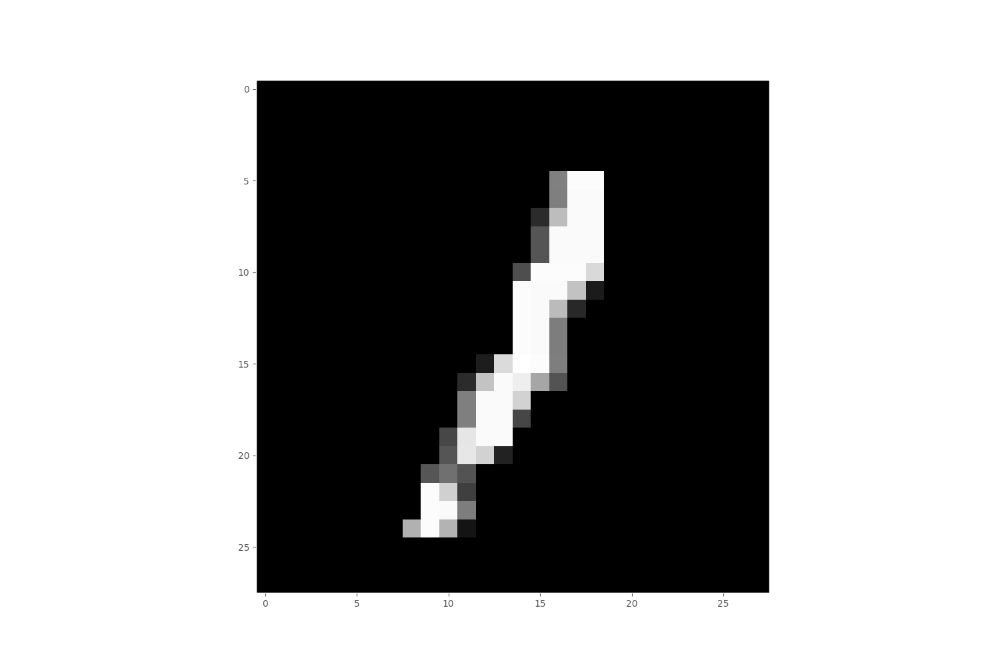
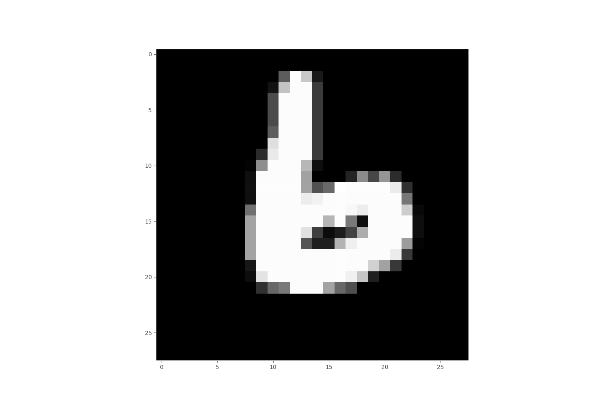
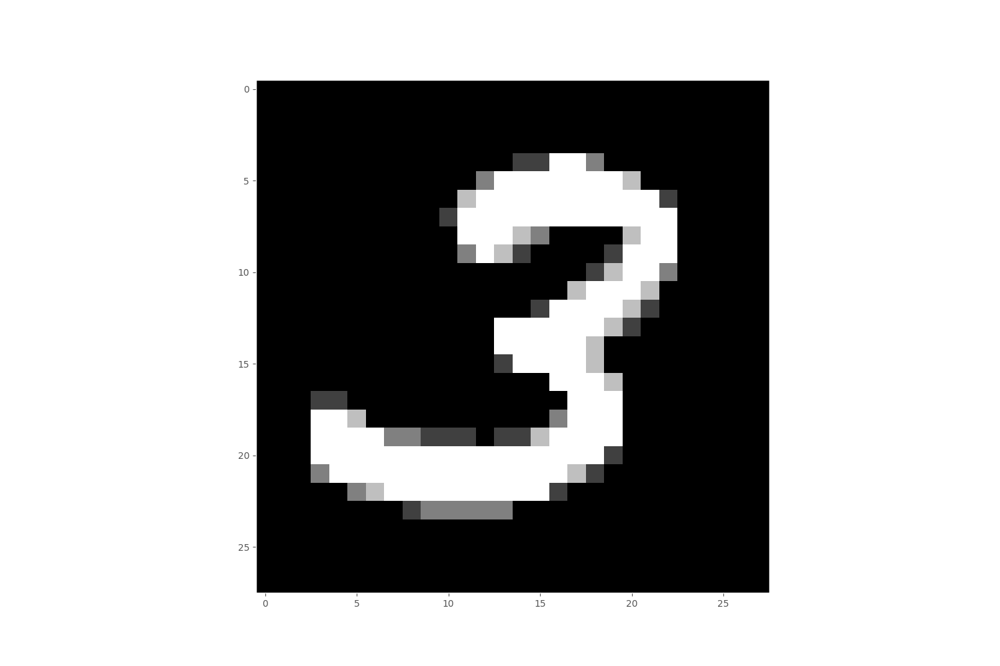

# Overview 

        Implementation of a variant of lenet to classify handwritten digits between 0 and 9. 
        
# Hyperparameters 
This section documents the hyperparameters used for this session. 
1. learning_rate: 0.001
2. epochs: 1
# Performance

# Datasets 
### Training Set 
The training set located at ./mnist_tf/train/mnist_train.tfrecords consists of 49000, served in batch sizes of 50.

### Validation Set 
The validation set located at ./mnist_tf/valid/mnist_valid.tfrecords consists of 14000, served in batch sizes of 50.

### Validation Set and Training Set Comparison 
This section compares the contents of the validation and train sets used.

# Dataset Examples
This section depicts one input for each label the model is expected to learn.
### Example 1 
1. height:28
2. width:28
3. depth:0
4. label:[0. 0. 1. 0. 0. 0. 0. 0. 0. 0.]

### Example 2 
1. height:28
2. width:28
3. depth:0
4. label:[1. 0. 0. 0. 0. 0. 0. 0. 0. 0.]

### Example 3 
1. height:28
2. width:28
3. depth:0
4. label:[0. 0. 0. 0. 0. 1. 0. 0. 0. 0.]

### Example 4 
1. height:28
2. width:28
3. depth:0
4. label:[0. 0. 0. 0. 0. 0. 0. 0. 0. 1.]

### Example 5 
1. height:28
2. width:28
3. depth:0
4. label:[0. 1. 0. 0. 0. 0. 0. 0. 0. 0.]

### Example 6 
1. height:28
2. width:28
3. depth:0
4. label:[0. 0. 0. 0. 0. 0. 1. 0. 0. 0.]

### Example 7 
1. height:28
2. width:28
3. depth:0
4. label:[0. 0. 0. 1. 0. 0. 0. 0. 0. 0.]

### Example 8 
1. height:28
2. width:28
3. depth:0
4. label:[0. 0. 0. 0. 0. 0. 0. 1. 0. 0.]

### Example 9 
1. height:28
2. width:28
3. depth:0
4. label:[0. 0. 0. 0. 1. 0. 0. 0. 0. 0.]

### Example 10 
1. height:28
2. width:28
3. depth:0
4. label:[0. 0. 0. 0. 0. 0. 0. 0. 1. 0.]

