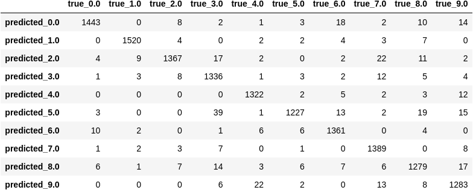
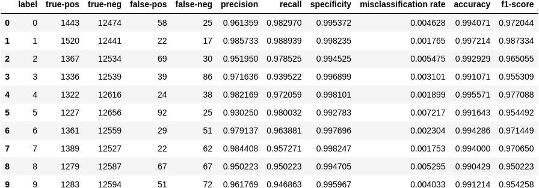
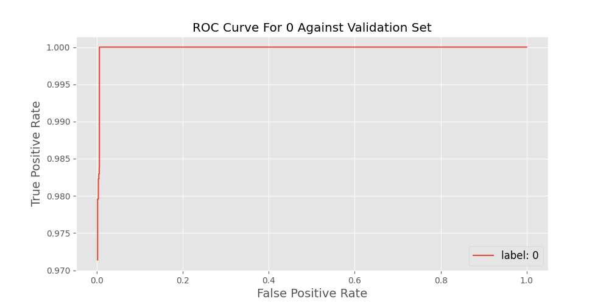
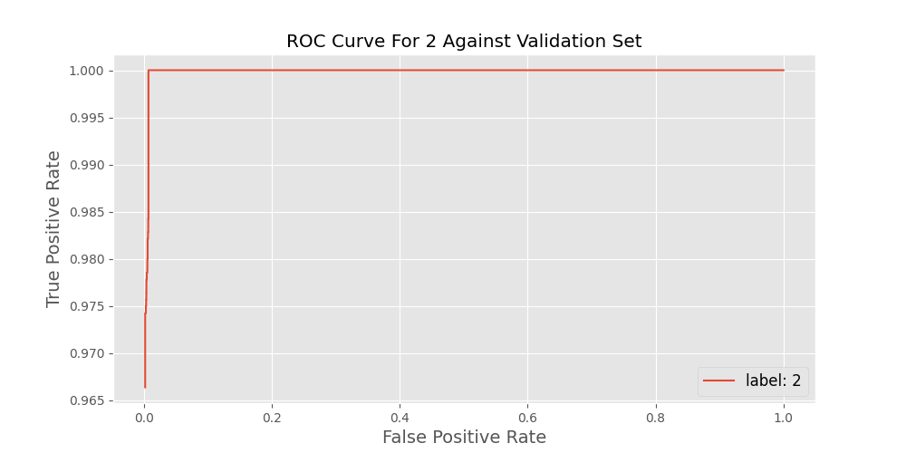
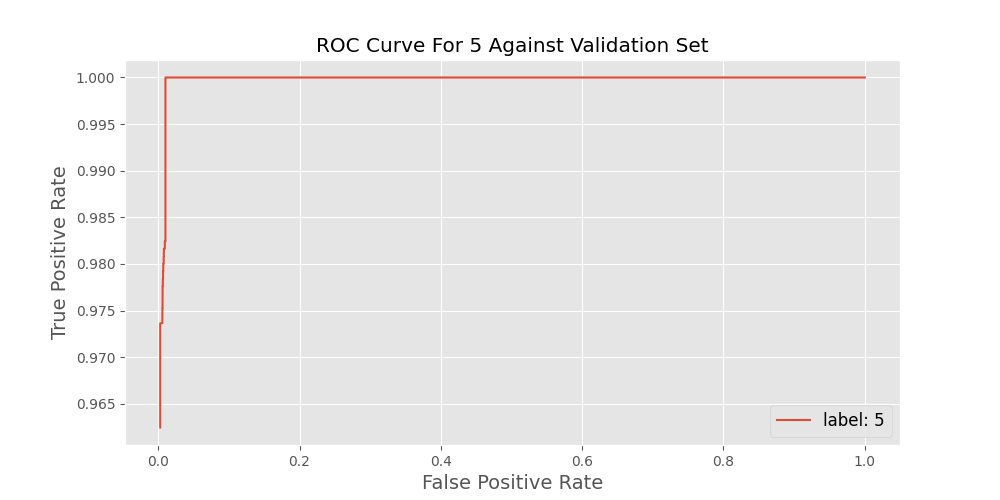
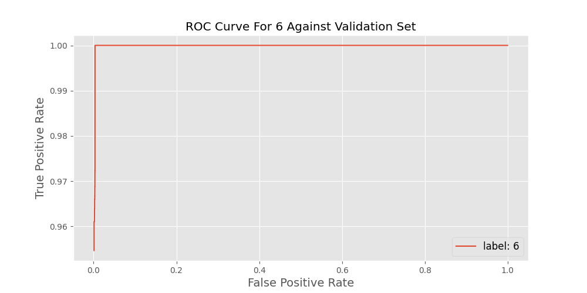
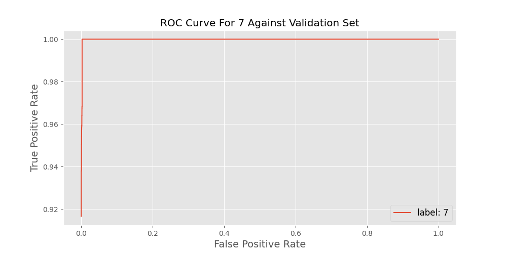
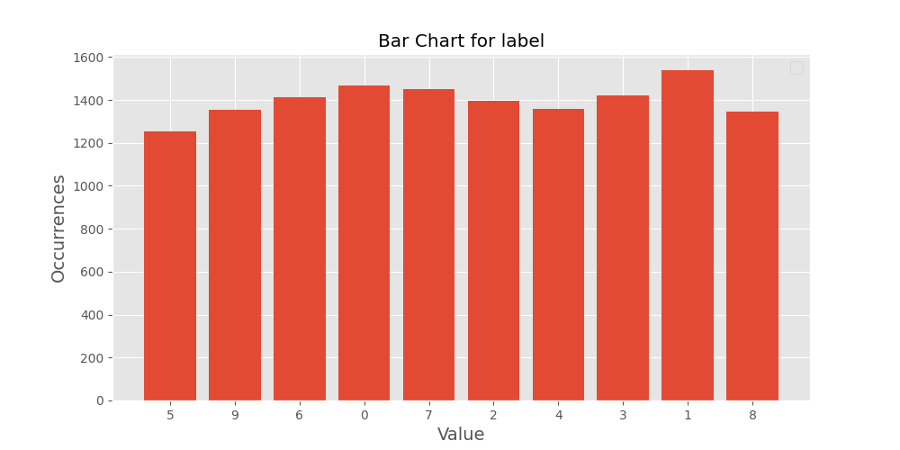

# Confusion Matrix Against Validation Set
The multi-class confusion matrix captures the true labels along the columns and the predicted labels along the rows. The cells contain counts for the intersection of true labels and predicted labels. 

# Score Matrix 
The score matrix contains the true positives, the true negatives, the false positives, the false negatives, the precision, the recall, the specificity, the misclassification rate, accuracy, and the f1 score for each labelthe classifier is trained on. 

# Multiclass Receiver Operating Characteristic (ROC) Curves 
The multiclass ROC curves were created using one-versus-rest classifications against the validation set.

# Validation Dataset 
The validation dataset located at ./mnist_tf/valid/mnist_valid.tfrecords consists of 14000, served in batch sizes of 1.
 The charts below depict the distribution of the features of this dataset

