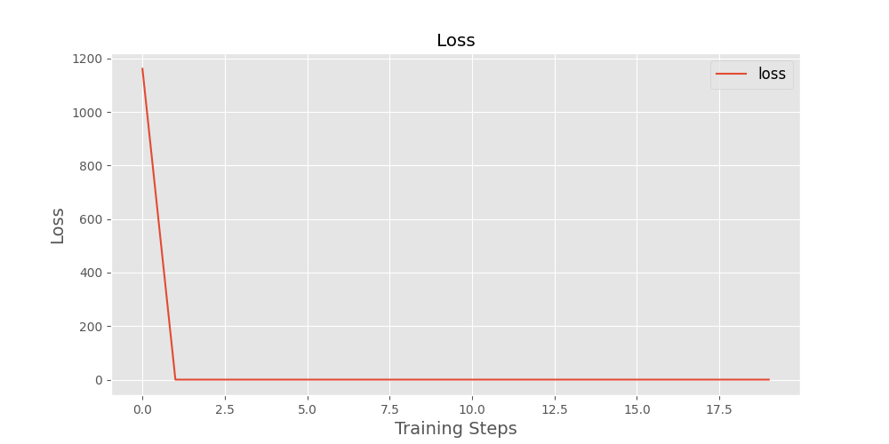
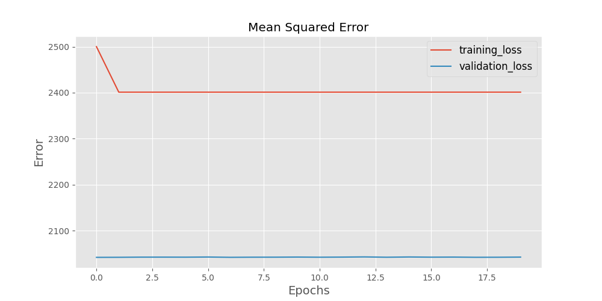
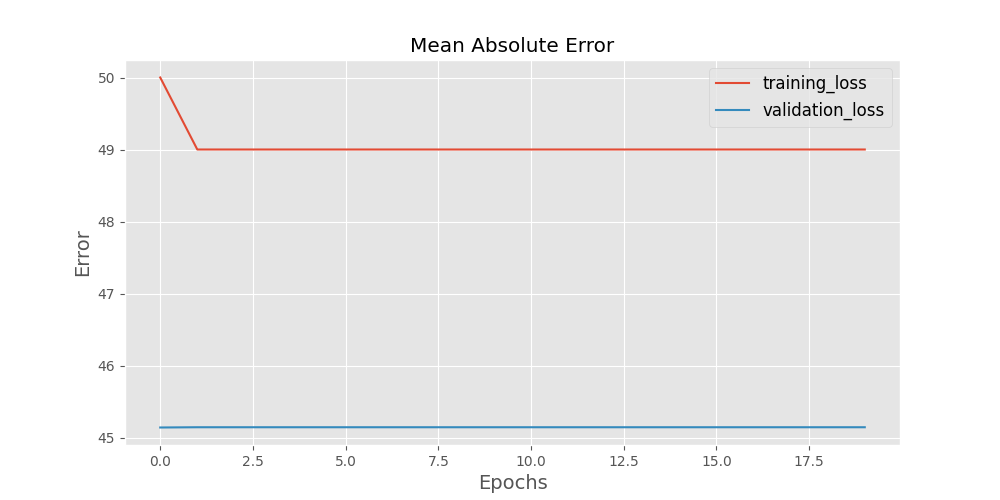
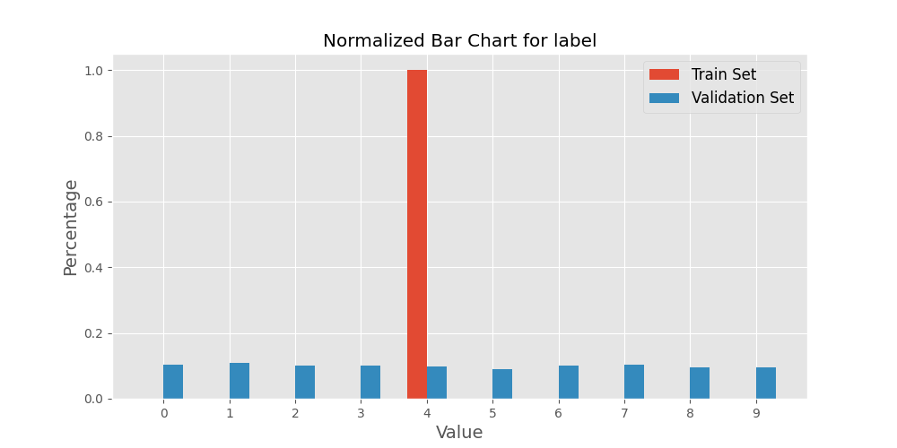
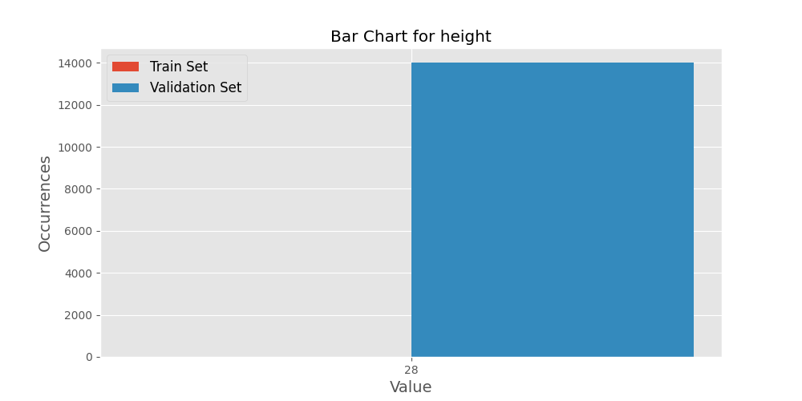

# Overview 

        Implementation of a variant of lenet to classify handwritten digits between 0 and 9. 
        
# Hyperparameters 
This section documents the hyperparameters used for this session. 
1. learning_rate: 0.001
2. epochs: 20
# Performance

# Datasets 
### Training Set 
The training set located at ./mnist_tf_1_train_example/train/mnist_train.tfrecords consists of 1, served in batch sizes of 1.

### Validation Set 
The validation set located at ./mnist_tf_1_train_example/valid/mnist_valid.tfrecords consists of 14000, served in batch sizes of 50.

### Validation Set and Training Set Comparison 
This section compares the contents of the validation and train sets used.

# Dataset Examples
This section depicts one input for each label the model is expected to learn.
### Example 1 
1. height:28
2. width:28
3. depth:0
4. label:[0. 0. 0. 0. 1. 0. 0. 0. 0. 0.]

