# Overview 

        Implementation of a variant of lenet to classify handwritten digits between 0 and 9. 
        
# Hyperparameters 
This section documents the hyperparameters used for this session. 
1. learning_rate: 0.001
2. epochs: 20
# Peformance
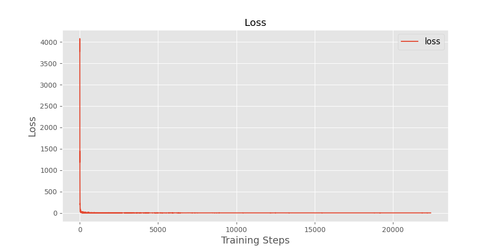
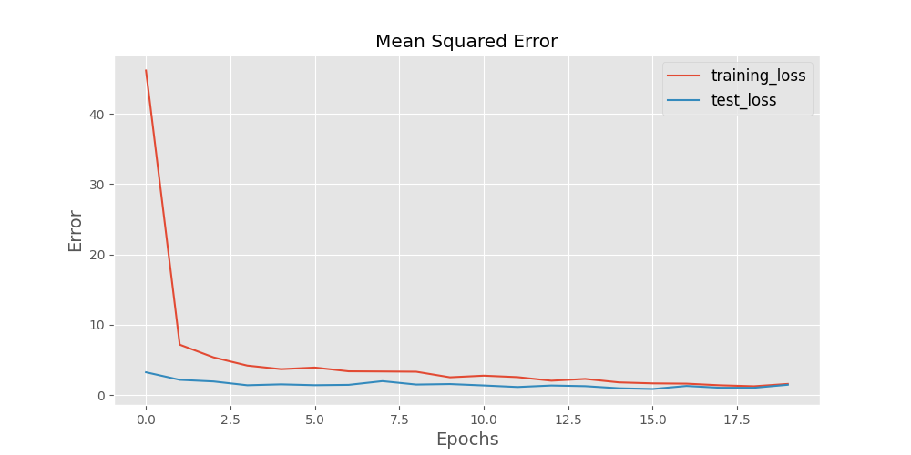
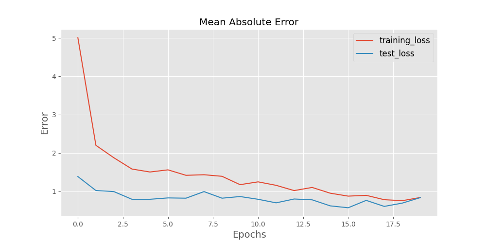
# Datasets 
### Training Set 
The training set located at ./mnist_tf/train/mnist_train.tfrecords consists of 56000, served in batch sizes of 50.
### Testing Set 
The testing set located at ./mnist_tf/test/mnist_test.tfrecords consists of 7000, served in batch sizes of 50.
### Test Set / Training Set Comparison 
This section compares the contents of the test and train sets used.

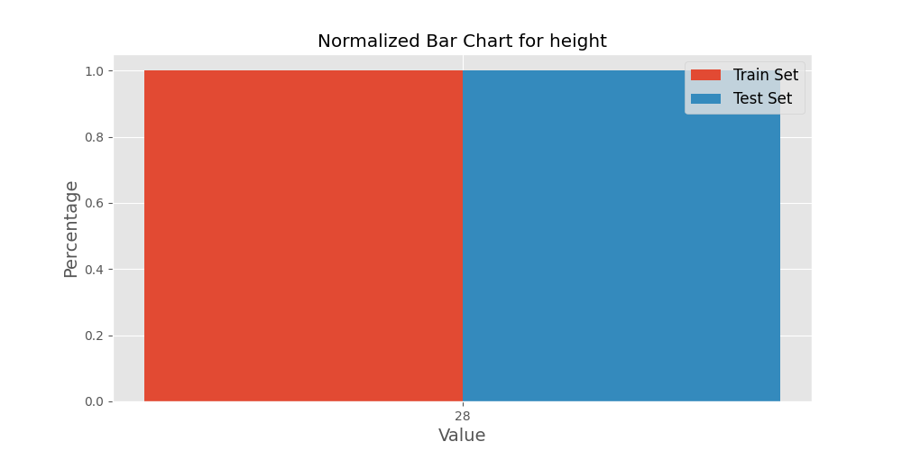
 

 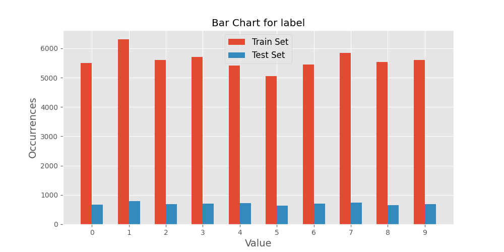
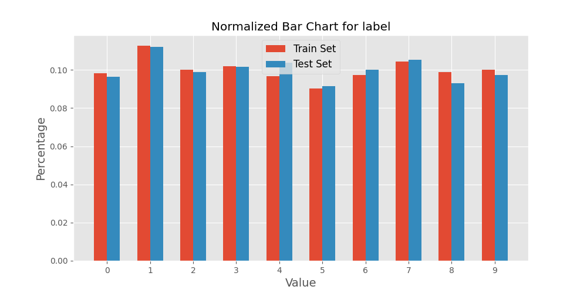
 

 

 

 # Dataset Examples
This section depicts one input for each label the model is expected to learn.
### Example 1 
0. height:28
1. width:28
2. depth:0
3. label:[1. 0. 0. 0. 0. 0. 0. 0. 0. 0.]

### Example 2 
0. height:28
1. width:28
2. depth:0
3. label:[0. 0. 0. 0. 0. 0. 0. 1. 0. 0.]

### Example 3 
0. height:28
1. width:28
2. depth:0
3. label:[0. 0. 0. 0. 0. 0. 0. 0. 0. 1.]
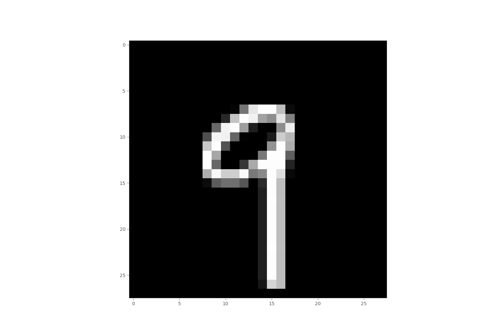
### Example 4 
0. height:28
1. width:28
2. depth:0
3. label:[0. 0. 0. 0. 1. 0. 0. 0. 0. 0.]

### Example 5 
0. height:28
1. width:28
2. depth:0
3. label:[0. 0. 0. 1. 0. 0. 0. 0. 0. 0.]

### Example 6 
0. height:28
1. width:28
2. depth:0
3. label:[0. 0. 1. 0. 0. 0. 0. 0. 0. 0.]
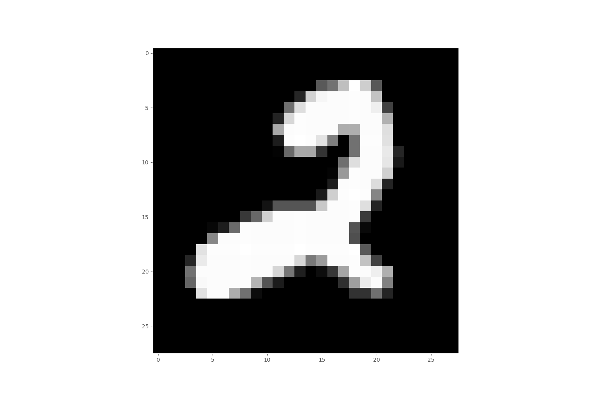
### Example 7 
0. height:28
1. width:28
2. depth:0
3. label:[0. 0. 0. 0. 0. 1. 0. 0. 0. 0.]
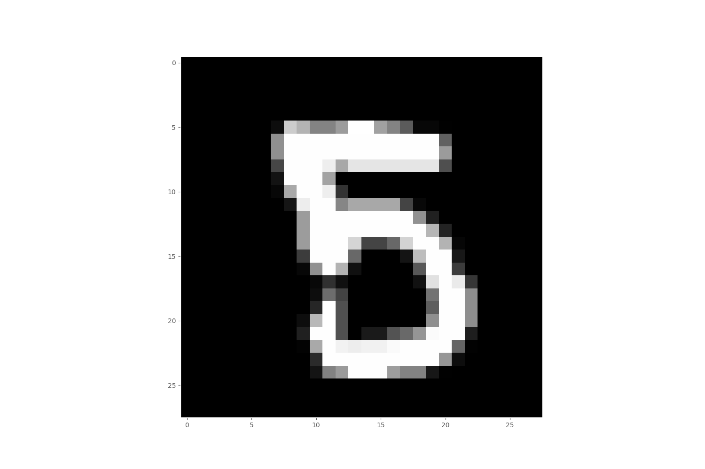
### Example 8 
0. height:28
1. width:28
2. depth:0
3. label:[0. 0. 0. 0. 0. 0. 1. 0. 0. 0.]
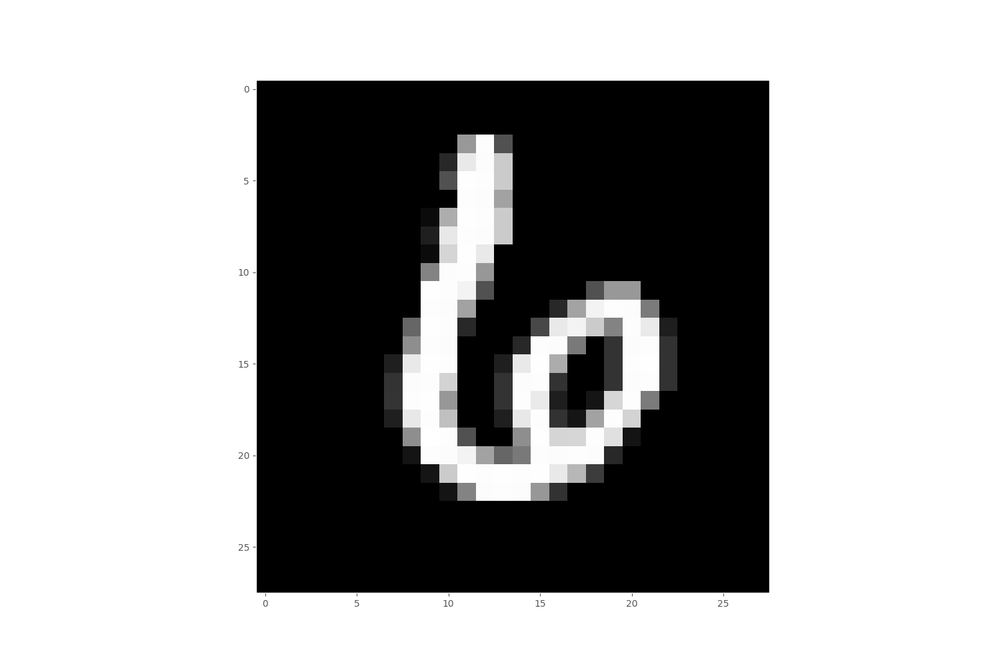
### Example 9 
0. height:28
1. width:28
2. depth:0
3. label:[0. 1. 0. 0. 0. 0. 0. 0. 0. 0.]
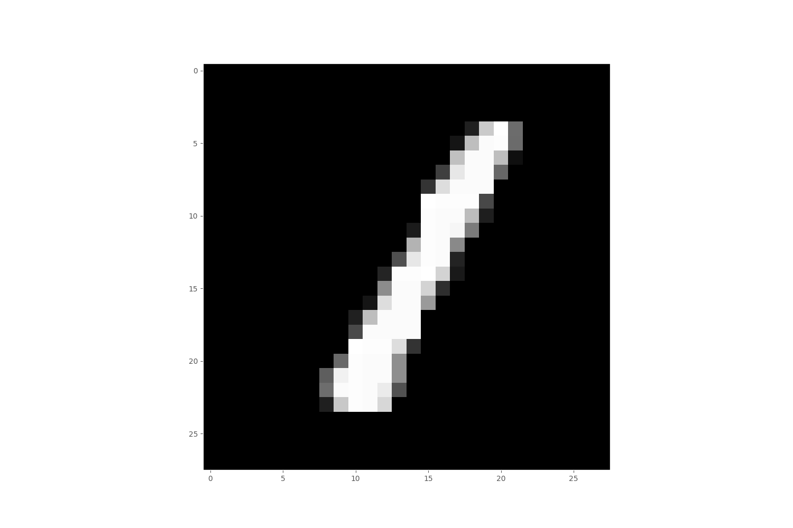
### Example 10 
0. height:28
1. width:28
2. depth:0
3. label:[0. 0. 0. 0. 0. 0. 0. 0. 1. 0.]
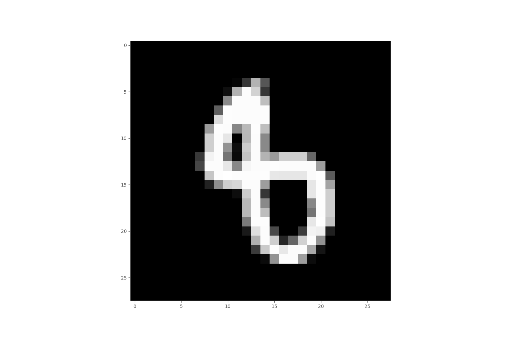
