# Overview 

        Implementation of a variant of lenet to classify simulated satellite events observed through electro-optical imagry. 
        
# Hyperparameters 
This section documents the hyperparameters used for this session. 
1. learning_rate: 0.001
2. epochs: 1
# Peformance
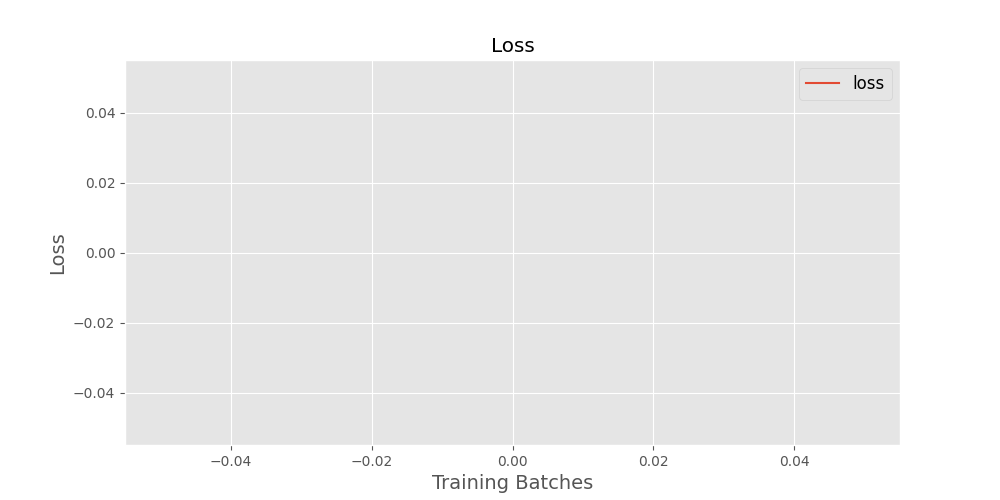
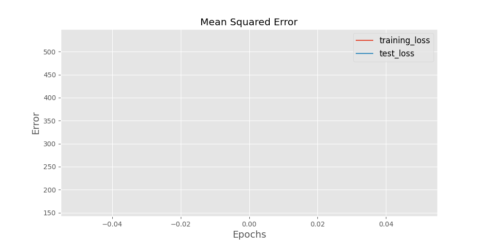
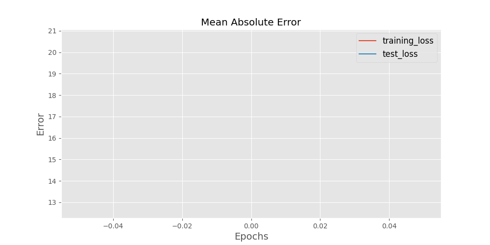
# Datasets 
### Training Set 
The training set located at ./generated_data_tfrecords/train/satsim_train.tfrecords consists of 1500, served in batch sizes of 50.
### Testing Set 
The testing set located at ./generated_data_tfrecords/test/satsim_test.tfrecords consists of 150, served in batch sizes of 50.
### Test Set / Training Set Comparison 
This section compares the contents of the test and train sets used.

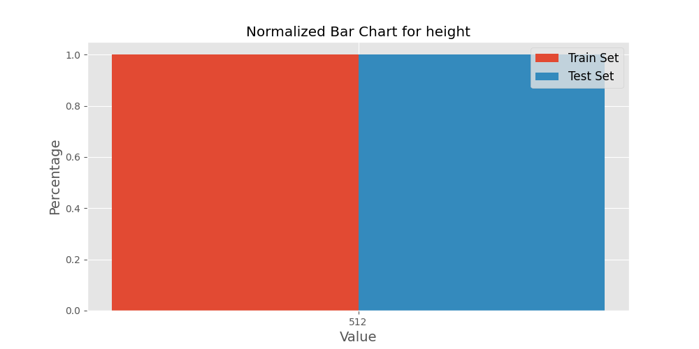
 

 
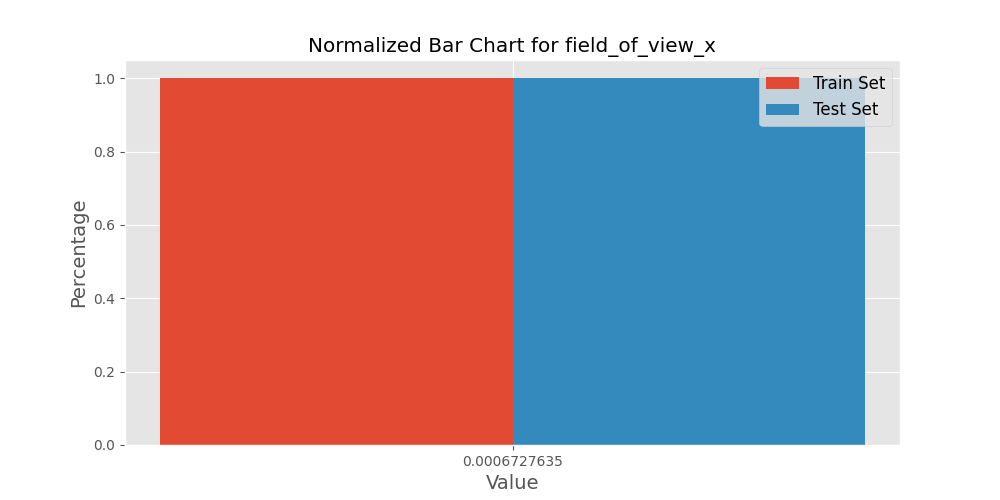
 

 

 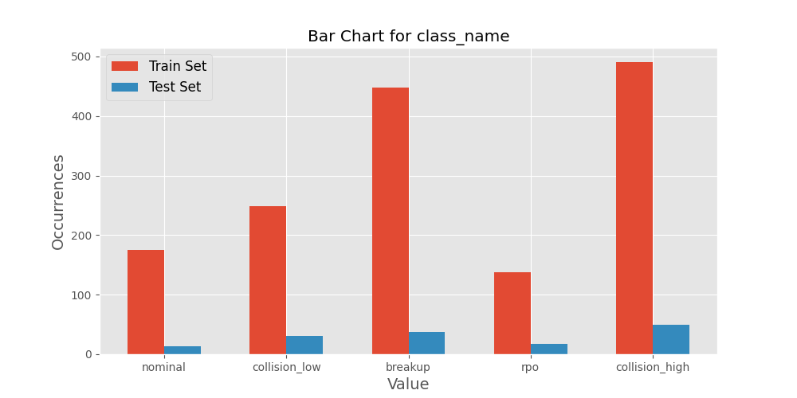
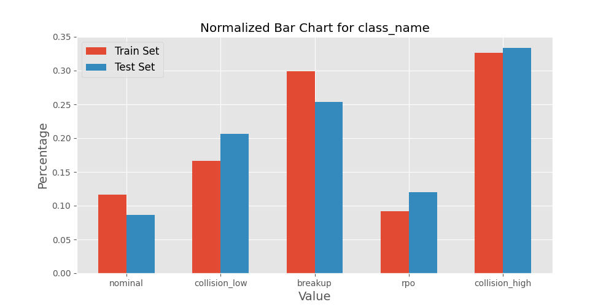
 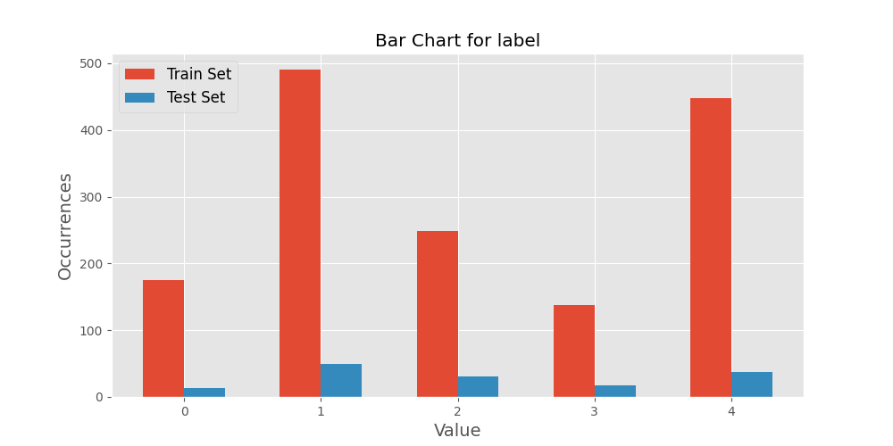
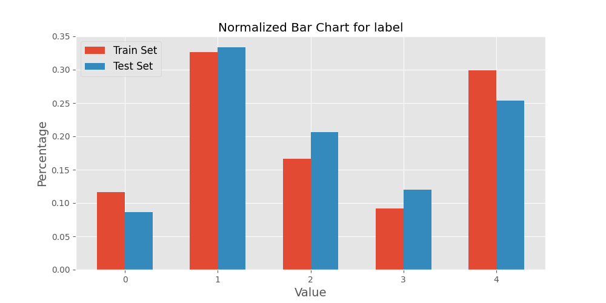
 

 

 

 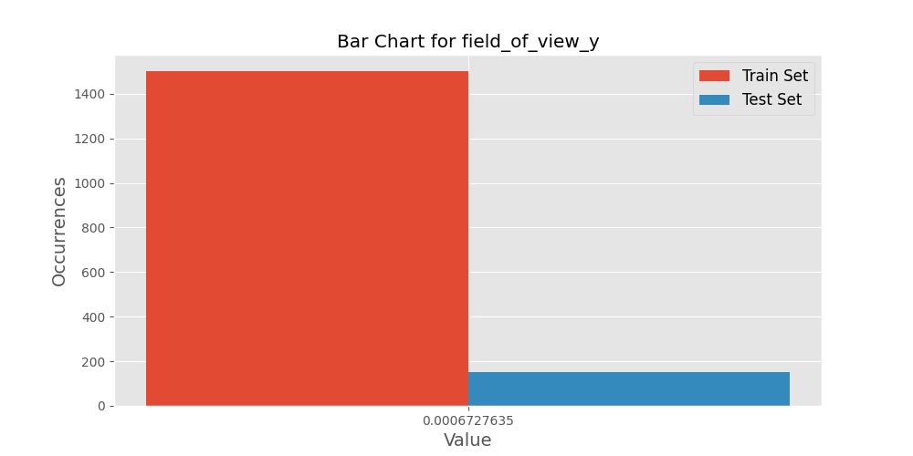

 

 

 

 # Dataset Examples
This section depicts one input for each label the model is expected to learn.
### Example 10. height:512
1. width:512
2. depth:16
3. field_of_view_x:0.0006727635045535862
4. field_of_view_y:0.0006727635045535862
5. stray_light:0
6. class_name:b'collision_high'
7. label:[0. 1. 0. 0. 0.]
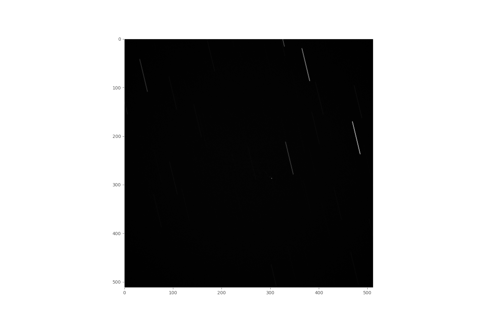
### Example 20. height:512
1. width:512
2. depth:16
3. field_of_view_x:0.0006727635045535862
4. field_of_view_y:0.0006727635045535862
5. stray_light:0
6. class_name:b'breakup'
7. label:[0. 0. 0. 0. 1.]

### Example 30. height:512
1. width:512
2. depth:16
3. field_of_view_x:0.0006727635045535862
4. field_of_view_y:0.0006727635045535862
5. stray_light:0
6. class_name:b'nominal'
7. label:[1. 0. 0. 0. 0.]

### Example 40. height:512
1. width:512
2. depth:16
3. field_of_view_x:0.0006727635045535862
4. field_of_view_y:0.0006727635045535862
5. stray_light:0
6. class_name:b'collision_low'
7. label:[0. 0. 1. 0. 0.]
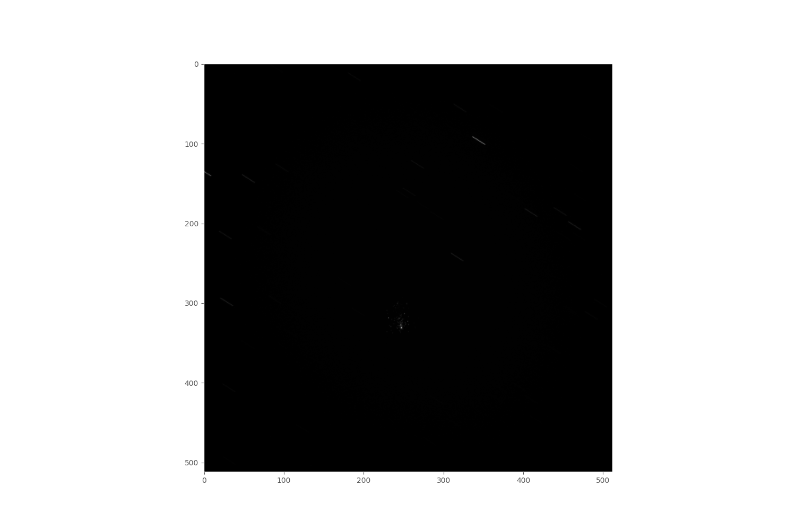
### Example 50. height:512
1. width:512
2. depth:16
3. field_of_view_x:0.0006727635045535862
4. field_of_view_y:0.0006727635045535862
5. stray_light:0
6. class_name:b'rpo'
7. label:[0. 0. 0. 1. 0.]

