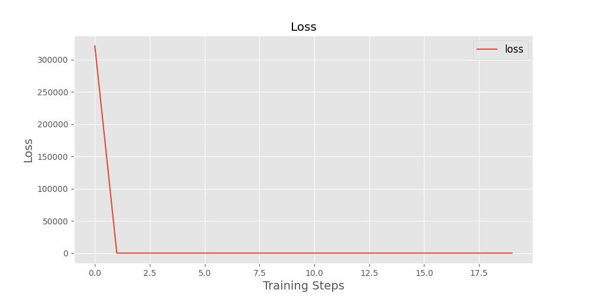
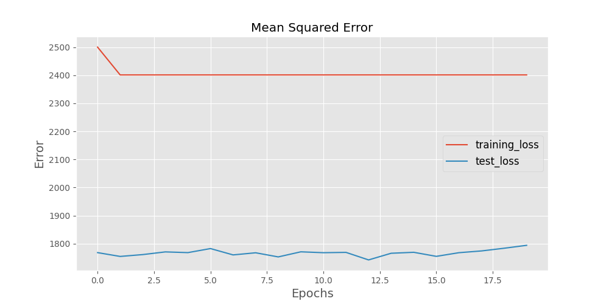
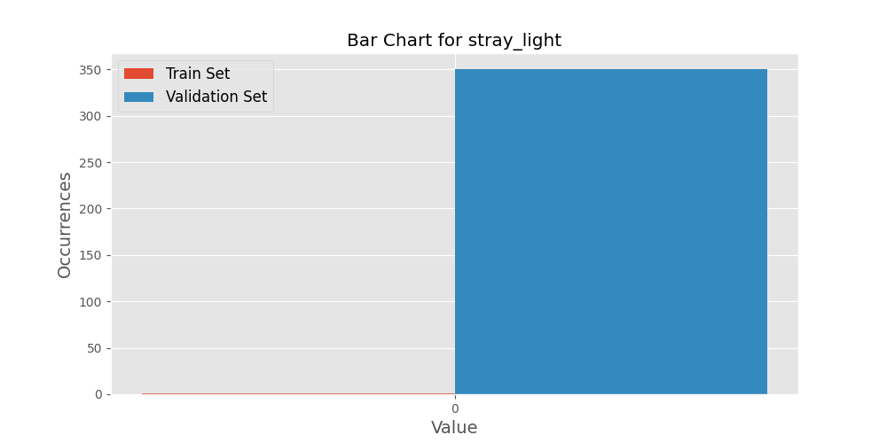
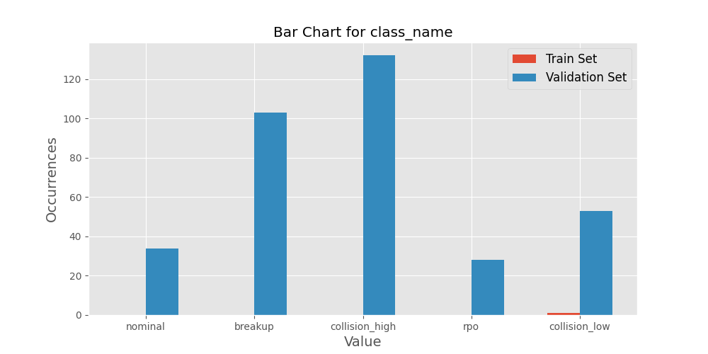
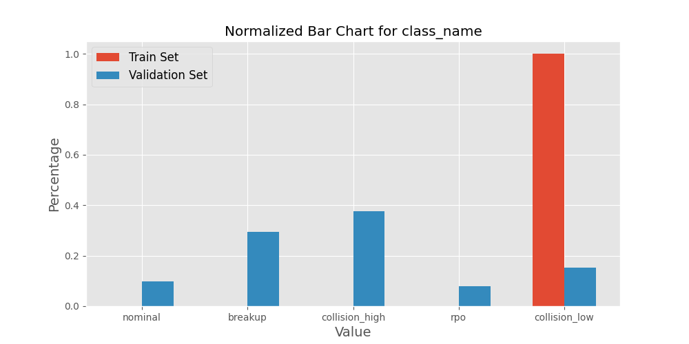
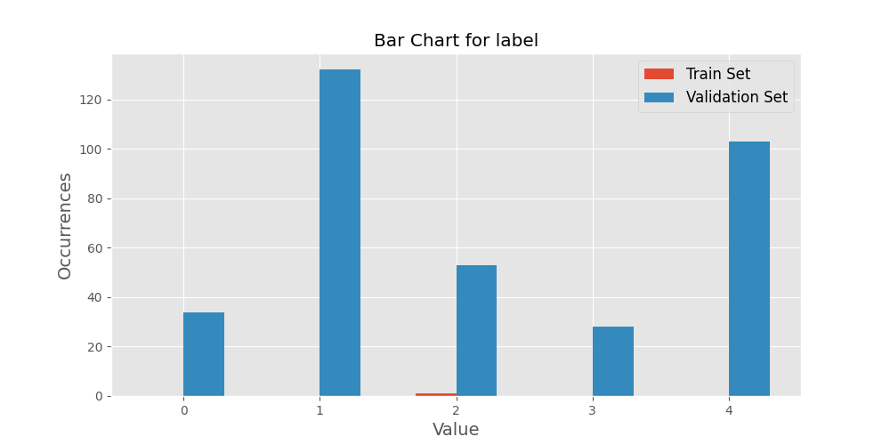
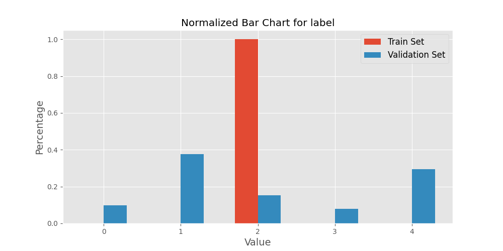

# Overview 

        Implementation of a variant of lenet to classify simulated satellite events observed through electro-optical imagry. 
        
# Hyperparameters 
This section documents the hyperparameters used for this session. 
1. learning_rate: 0.001
2. epochs: 20
# Performance

# Datasets 
### Training Set 
The training set located at /media/ada/Internal Expansion/shenanigans_storage/generated_data_tf_1_train_example/train/satsim_train.tfrecords consists of 1, served in batch sizes of 1.

### Validation Set 
The validation set located at /media/ada/Internal Expansion/shenanigans_storage/generated_data_tf_1_train_example/valid/satsim_valid.tfrecords consists of 350, served in batch sizes of 50.

### Validation Set and Training Set Comparison 
This section compares the contents of the validation and train sets used.

# Dataset Examples
This section depicts one input for each label the model is expected to learn.
### Example 1 
1. height:512
2. width:512
3. depth:16
4. field_of_view_x:0.0006727635045535862
5. field_of_view_y:0.0006727635045535862
6. stray_light:0
7. class_name:b'collision_low'
8. label:[0. 0. 1. 0. 0.]

